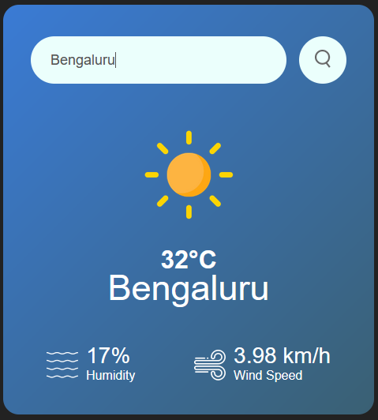

🌤 Weather App
A simple weather application that allows users to search for a city and get real-time weather details, including:

1.Temperature (in Celsius)

2.Humidity

3.Wind Speed

Features
1.Search for a city to get weather details
2.Displays temperature, humidity, and wind speed
3.Clean and user-friendly interface

Technologies
HTML, CSS, JavaScript (Frontend)

Weather API (for fetching live weather data)

Installation & Usage
1.Clone the repository:

git clone https://github.com/velayutham1706/weather-app.git
cd weather-app

2.Open index.html in a browser

3.Enter a city name and view the weather details

API Integration
Make sure to get an API key from OpenWeatherMap or any other weather API provider. Replace the API key in the script tag:

const apiKey = "your_api_key_here";

If you are using any other API provider, change the URL too:

const apiUrl = "your_api_provider_url";
